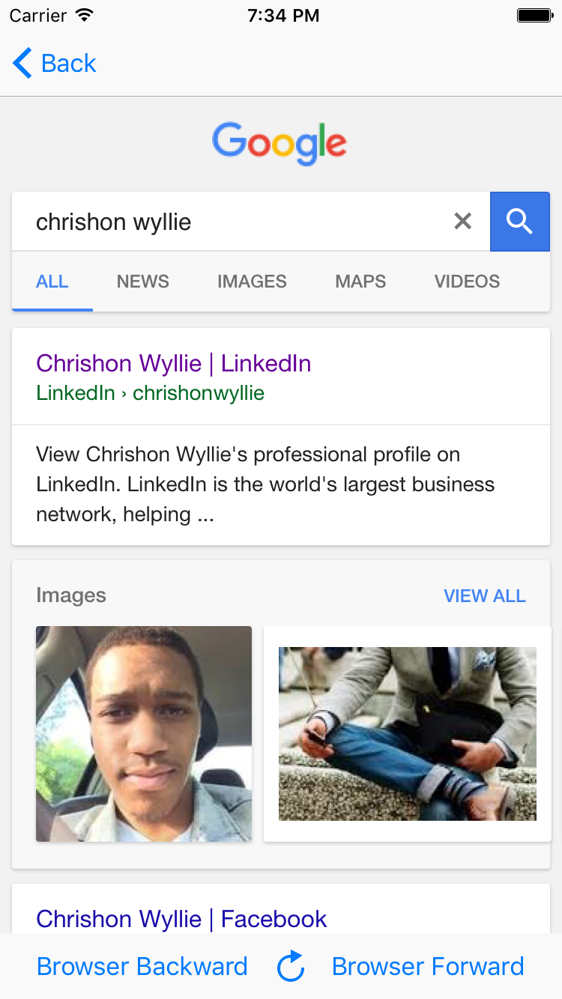
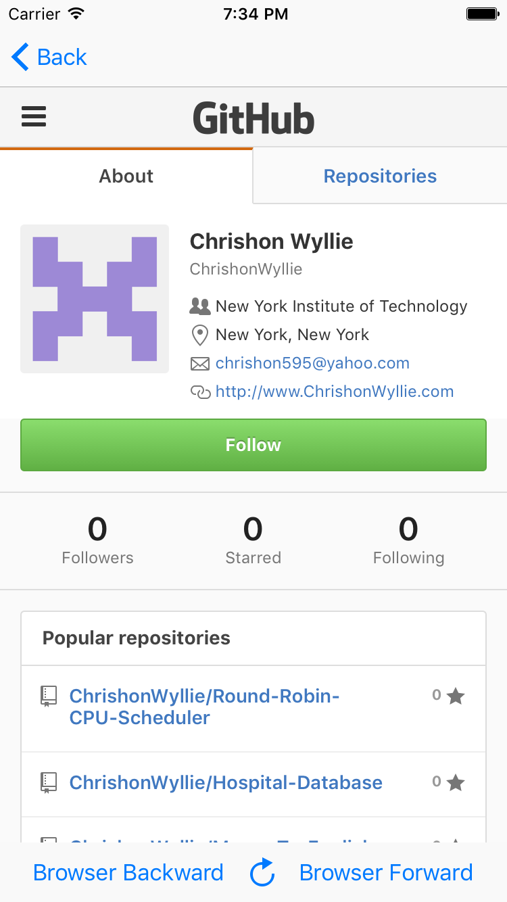

# WebView

This is an example of using a WebView in your app.

Why would you want to use this? To give your users a quick view into your website without having to leave the app. 
For example if you used my [SettingsPage example](https://github.com/ChrishonWyllie/SettingsPage), you will want to show
your users your privacy policy or terms of service without having to leave the app and open a browser app. 

This is not necessary but adds a little flair and ease-of-use to your app. Additionally, it is used in a few popular apps 
which you may have seen already.

